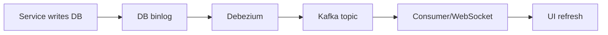
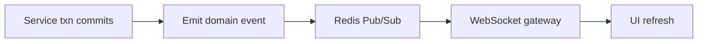
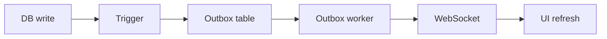
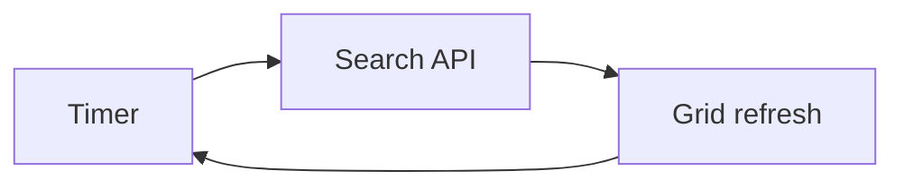
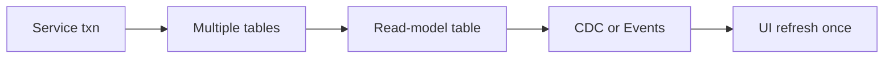

# Live Data Options — Approaches, Flow, Pros/Cons, Best Fit

This document lists practical ways to achieve live data updates, with flow, examples, pros/cons, and a recommendation for this repo.

## 1) CDC (Debezium + Kafka)

**Flow**
1. Service writes to DB.
2. DB writes binlog.
3. Debezium reads binlog and emits events to Kafka topics.
4. Consumer service reads Kafka and broadcasts to WebSocket clients.
5. UI updates grid and form.

**Example**
- Sales order updated in DB. Debezium emits to Kafka topic `sales_orders_view`. WebSocket gateway pushes to clients. Grid refreshes that row.

**Flow Chart**

**Pros**
- No service code changes.
- Captures all tables and all changes.
- Reliable, replayable, scalable.
- Best for many services and many tables.

**Cons**
- More infrastructure (Kafka, Debezium).
- Operational complexity.
- CDC lag must be monitored.

**Best for**
- Large orgs with 100+ services and 1000+ tables.
- When you cannot change services.

---

## 2) Service-Boundary Events (Domain Events + Redis + WebSocket)

**Flow**
1. Service completes transaction.
2. After commit, service emits one domain event, for example `sales_order_updated`.
3. Redis pub/sub relays to WebSocket gateway.
4. UI receives event and refreshes row or grid.

**Example**
- Django service emits `sales_order_updated { id: 101 }`. WebSocket pushes to UI. UI calls `GET /sales-orders/101` and updates the row.

**Flow Chart**

**Pros**
- Minimal infrastructure.
- Clean, explicit business events.
- Low latency.

**Cons**
- Requires changes in every service that updates data.
- Risk of missing events if developers forget to emit.

**Best for**
- Teams that can update services and want simple infra.

---

## 3) DB Triggers + Outbox (No Kafka)

**Flow**
1. Trigger writes to `outbox_events` on change.
2. Small worker polls outbox and emits to WebSocket.
3. UI refreshes.

**Example**
- Trigger on `sales_orders` inserts to outbox. Worker reads and broadcasts. UI refreshes that row.

**Flow Chart**

**Pros**
- No service changes.
- Works with many services.

**Cons**
- DB triggers add complexity.
- Outbox table still needs cleanup.

**Best for**
- Environments that allow triggers but want to avoid Kafka.

---

## 4) Direct Query Polling (Client or Server)

**Flow**
1. UI polls search API every X seconds.
2. UI replaces grid with latest data.

**Example**
- Grid calls `GET /sales-orders?filter=...` every 5 seconds and refreshes the result set.

**Flow Chart**

**Pros**
- Simplest. No infra.
- Works everywhere.

**Cons**
- Not real-time.
- Higher DB load if many users.

**Best for**
- Low traffic or basic MVP.

---

## 5) Materialized Read-Model Tables (View Tables)

**Flow**
1. Service updates multiple tables in one transaction.
2. Same transaction updates a single read-model table, for example `sales_orders_view`.
3. CDC or events listen only to the view table.
4. UI updates once.

**Example**
- Sales order update touches `orders`, `customers`, `products`, and writes to `sales_orders_view`. UI listens only to `sales_orders_view` and updates once.

**Flow Chart**

**Pros**
- Single UI update per business action.
- Easy to query and display.
- Avoids multi-topic ordering issues.

**Cons**
- Extra table maintenance.
- Must keep view table in sync.

**Best for**
- Multi-table forms and grids.

---

## Best Fit for This Repo

**Given your constraints**
- 100+ services
- 1000+ tables
- Prefer no service changes

**Best overall**
- CDC with Debezium + Kafka
- Use read-model tables per module for single UI updates

**If you can update services**
- Domain events + Redis + WebSocket gateway
- Still use read-model tables for single UI update

---

## Decision Summary

- No service changes + real-time ? CDC (Debezium + Kafka)
- Service changes allowed + simple infra ? Domain events + Redis
- No infra + basic needs ? Polling

---

## Multi-Table Single UI Update (Recommended Pattern)

**Use a read-model table per module**
- Example: `sales_orders_view` contains fields from orders, customers, products.
- UI listens only to `sales_orders_view` updates.

**Benefits**
- One update per save.
- Cleaner UI logic.
- More scalable.

---

## Comparison Table

| Approach | Service Changes | Infra | Real-time | Complexity | Best Fit |
| --- | --- | --- | --- | --- | --- |
| CDC (Debezium + Kafka) | No | High | Yes | High | Large systems with many services/tables |
| Domain Events + Redis | Yes | Low | Yes | Medium | Teams that can modify services |
| Triggers + Outbox | No | Medium | Near | Medium | DBs that allow triggers |
| Polling | No | Low | No | Low | MVPs or low traffic |
| Read-Model Tables | Sometimes | Low-Medium | Yes | Medium | Multi-table forms/grids |

---

If you want, I can add a migration path and a cost estimate section.
