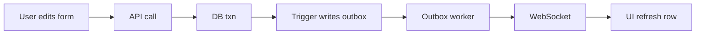
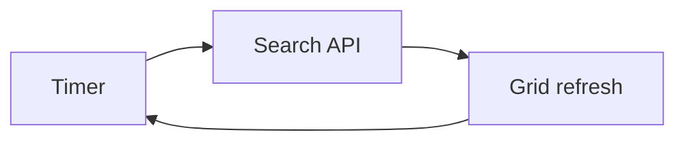
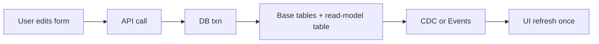

# Live Data Options — Approaches, Flow, Pros/Cons, Best Fit

<!-- This document lists practical ways to achieve live data updates, with flow, examples, pros/cons, and a recommendation for this repo. -->

## 1) CDC (Change Data Capture) via Debezium + Kafka

**Flow**
1. Service writes to DB.
2. DB writes binlog.
3. Debezium reads binlog and emits events to Kafka topics.
4. Consumer service reads Kafka and broadcasts to WebSocket clients.
5. UI updates grid and form.

**Key Terms (short definitions)**
- **DB binlog**: A write-ahead log of all committed row changes in the database.
- **Debezium**: A CDC connector that reads the binlog and converts DB changes into structured events.
- **Kafka**: A durable, ordered event log (topic-based) that stores change events for consumers.
- **Topic**: A named stream of events, usually one per table or view table.
- **Consumer**: A service that reads events from Kafka and reacts (here: emits WebSocket updates).
- **WebSocket gateway**: A server that keeps open connections to browsers and pushes events instantly.
- **Read-model table**: A denormalized table built for UI queries (e.g., `sales_orders_view`).

**Example**
- Sales order update touches `sales_orders`, `users`, `products`, and the service writes one row into `sales_orders_view`.
- Debezium emits change event for `sales_orders_view`.
- WebSocket gateway broadcasts `module:data_updated` for `sales_orders`.
- Grid refreshes row `id=101`.

**Flow Chart**
```text
----------------------------+
| UI                        |
| User edits form -> Save   |
+---------------------------+
              |
              v
+---------------------------+
| API Service               |
| HTTP call -> Business逻ic |
+---------------------------+
              |
              v
+---------------------------+
| Database                  |
| Txn commit                |
| Base tables updated       |
| Read-model updated        |
| Binlog entry written      |
+---------------------------+
              |
              v
+---------------------------+
| CDC Pipeline              |
| Debezium -> Kafka topic   |
| CDC consumer              |
+---------------------------+
              |
              v
+---------------------------+
| Realtime Delivery         |
| WebSocket gateway         |
+---------------------------+
              |
              v
+---------------------------+
| UI                        |
| Grid refresh row          |
+---------------------------+
```

**Detailed Flow (single user save)**
1. User edits Sales Order in form and clicks Save.
2. Service updates multiple base tables in one transaction.
3. Same transaction updates `sales_orders_view` row `id=101`.
4. MariaDB binlog records the `sales_orders_view` row change.
5. Debezium emits the change to Kafka topic `sales_orders_view`.
6. Consumer reads message and emits `module:data_updated` with `{ module: "sales_orders", id: 101 }`.
7. UI requests `GET /api/modules/sales_orders` or `GET /api/modules/sales_orders/101` and updates the grid row.

**Cross-Module Example (Customer edit updates Sales grid)**
1. User edits Customer in the Customers form.
2. Service updates `users` and recomputes affected `sales_orders_view` rows (all orders for that customer).
3. Each updated `sales_orders_view` row is written in the same transaction.
4. Debezium emits updates for those rows to Kafka.
5. Consumer maps those events to the Sales module and emits `module:data_updated`.
6. Sales grid refreshes the impacted rows (or re-fetches the page).

**Why Debezium**
- Reads DB binlog without service code changes.
- Emits structured change events reliably.
- Handles schema evolution and resuming from offsets.

**Why Kafka**
- Durable event log with replay.
- Scales to many tables and high write volume.
- Many consumers can read the same stream independently.

**Why Kafka (and why "only" Kafka here)**
- Debezium is built to publish to Kafka first-class; it is the most mature and supported path.
- Kafka provides ordering per topic, retention, and replay, which are critical for CDC streams.
- Other brokers exist, but they often require extra connectors, add operational risk, or lose replay/ordering guarantees.

**Operational Considerations**
- **Setup complexity**: Highest. Requires Kafka, Zookeeper or KRaft, Debezium Connect, monitoring.
- **Resources**: Moderate to high. Kafka and Connect need memory and disk; storage grows with retention.
- **GCP compatibility**: Works well on GKE or Compute Engine. Managed Kafka (Confluent Cloud) reduces ops.
- **DB performance**: Binlog adds write overhead and disk I/O. Usually acceptable, but monitor write volume.
- **Failure handling**: Use offsets and retries. Consumer must be idempotent for safe reprocessing.

**When you actually need this stack**
- You cannot modify services.
- You need guaranteed capture for 1000+ tables.
- You need replay or multiple consumers.

**When it is not required**
- You can emit domain events from services.
- You only need a few modules updated live.
- Simpler infra is acceptable.

**Pros**
- No service code changes.
- Captures all tables and all changes.
- Reliable, replayable, scalable.
- Best for many services and many tables.

**Cons**
- More infrastructure (Kafka, Debezium).
- Operational complexity.
- CDC lag must be monitored.

**Best for**
- Large orgs with 100+ services and 1000+ tables.
- When you cannot change services.

---

## 2) Service-Boundary Events (Domain Events + Redis + WebSocket)

**Flow**
1. Service completes transaction.
2. After commit, service emits one domain event, for example `sales_order_updated`.
3. Redis pub/sub relays to WebSocket gateway.
4. UI receives event and refreshes row or grid.

**Key Terms (short definitions)**
- **Domain event**: A business-level signal emitted after a successful transaction (e.g., `sales_order_updated`).
- **Redis Pub/Sub**: A lightweight publish/subscribe channel to broadcast events in real time.
- **WebSocket gateway**: A server that pushes events to all connected browsers.
- **Read-model table**: A denormalized table built for UI queries (optional but recommended).

**Example**
- Django service emits `sales_order_updated { id: 101 }` after commit.
- WebSocket pushes to UI.
- UI calls `GET /sales-orders/101` and updates the row.

**Flow Chart**
```text
+---------------------------+
| UI                        |
| User edits form -> Save   |
+---------------------------+
              |
              v
+---------------------------+
| API Service               |
| HTTP call -> Businesslogic|
| Domain event emit         |
+---------------------------+
              |
              v
+---------------------------+
| Database                  |
| Txn commit                |
+---------------------------+
              |
              v
+---------------------------+
| Realtime Delivery         |
| Redis Pub/Sub             |
| WebSocket gateway         |
+---------------------------+
              |
              v
+---------------------------+
| UI                        |
| Grid refresh row          |
+---------------------------+
```

**Detailed Flow (single user save)**
1. User edits Sales Order in form and clicks Save.
2. Service runs multi-table logic in a single transaction.
3. After commit, service publishes `sales_order_updated` with `{ id: 101 }`.
4. Redis relays event to WebSocket gateway.
5. UI receives event and fetches the updated row.

**Cross-Module Example (Customer edit updates Sales grid)**
1. User edits Customer in the Customers form.
2. Service commits changes and emits `customer_updated { id: 55 }`.
3. A small projector or read-model updater recalculates affected `sales_orders_view` rows.
4. The updater emits `sales_order_updated` for impacted orders (or emits `sales_orders_refresh` with filter).
5. WebSocket pushes events and Sales grid refreshes impacted rows.

**Operational Considerations**
- **Setup complexity**: Low. Redis + WebSocket gateway only.
- **Resources**: Low. Redis Pub/Sub is lightweight for small to medium scale.
- **GCP compatibility**: Redis via Memorystore; WebSocket service on GKE or Cloud Run.
- **DB performance**: No binlog impact. DB load depends on how often UI refetches rows.
- **Failure handling**: Redis Pub/Sub is transient. If clients miss events, UI must refetch or poll.

**Pros**
- Minimal infrastructure.
- Clean, explicit business events.
- Low latency.

**Cons**
- Requires changes in every service that updates data.
- Risk of missing events if developers forget to emit.

**Best for**
- Teams that can update services and want simple infra.

---

## 3) DB Triggers + Outbox (No Kafka)

**Flow**
1. Trigger writes to `outbox_events` on change.
2. Small worker polls outbox and emits to WebSocket.
3. UI refreshes.

**Example**
- Trigger on `sales_orders_view` inserts to outbox.
- Worker reads outbox and broadcasts.
- UI refreshes row `id=101`.

**Flow Chart**


**Detailed Flow (single user save)**
1. User edits Sales Order and clicks Save.
2. Transaction updates base tables and `sales_orders_view`.
3. Trigger writes one row into `outbox_events`.
4. Worker reads the outbox row and publishes `module:data_updated`.
5. UI fetches the updated row and refreshes grid.

**Pros**
- No service changes.
- Works with many services.

**Cons**
- DB triggers add complexity.
- Outbox table still needs cleanup.

**Best for**
- Environments that allow triggers but want to avoid Kafka.

---

## 4) Direct Query Polling (Client or Server)

**Flow**
1. UI polls search API every X seconds.
2. UI replaces grid with latest data.

**Example**
- Grid calls `GET /sales-orders?filter=...` every 5 seconds and refreshes the result set.

**Flow Chart**


**Detailed Flow (single user save)**
1. User saves changes.
2. Service commits updates to DB.
3. Grid continues to poll every X seconds.
4. Next poll returns the updated row and UI refreshes.

**Pros**
- Simplest. No infra.
- Works everywhere.

**Cons**
- Not real-time.
- Higher DB load if many users.

**Best for**
- Low traffic or basic MVP.

---

## 5) Materialized Read-Model Tables (View Tables)

**Flow**
1. Service updates multiple tables in one transaction.
2. Same transaction updates a single read-model table, for example `sales_orders_view`.
3. CDC or events listen only to the view table.
4. UI updates once.

**Example**
- Sales order update touches `orders`, `customers`, `products`, and writes to `sales_orders_view`.
- UI listens only to `sales_orders_view` and updates once.

**Flow Chart**


**Detailed Flow (single user save)**
1. User updates fields from multiple tables in one form.
2. Service updates base tables and the read-model table in the same transaction.
3. CDC or domain event fires only on the read-model table.
4. UI refreshes a single row.

**Pros**
- Single UI update per business action.
- Easy to query and display.
- Avoids multi-topic ordering issues.

**Cons**
- Extra table maintenance.
- Must keep view table in sync.

**Best for**
- Multi-table forms and grids.

---

## Best Fit for This Repo

**Given your constraints**
- 100+ services
- 1000+ tables
- Prefer no service changes

**Best overall**
- CDC with Debezium + Kafka
- Use read-model tables per module for single UI updates

**If you can update services**
- Domain events + Redis + WebSocket gateway
- Still use read-model tables for single UI update

---

## Decision Summary

- No service changes + real-time ? CDC (Debezium + Kafka)
- No service changes + no Kafka ? Debezium Server -> HTTP
- Service changes allowed + simple infra ? Domain events + Redis
- No infra + basic needs ? Polling

---

## Multi-Table Single UI Update (Recommended Pattern)

**Use a read-model table per module**
- Example: `sales_orders_view` contains fields from orders, customers, products.
- UI listens only to `sales_orders_view` updates.

**Benefits**
- One update per save.
- Cleaner UI logic.
- More scalable.

**Concrete Multi-Table Example**
1. Form fields: `order_status`, `order_total`, `customer_name`, `customer_tier`, `product_sku`, `product_price`.
2. Save updates these tables: `sales_orders` (status, total); `users` (name, tier); `products` (sku, price).
3. Same transaction updates `sales_orders_view` with those 10 fields.
4. UI listens only to `sales_orders_view` and refreshes row `id=101` once.

---

## Comparison Table

| Approach | Service Changes | Infra | Real-time | Complexity | Best Fit |
| --- | --- | --- | --- | --- | --- |
| CDC (Debezium + Kafka) | No | High | Yes | High | Large systems with many services/tables |
| CDC (Debezium Server -> HTTP) | No | Medium | Yes | Medium | Smaller stacks without Kafka |
| Domain Events + Redis | Yes | Low | Yes | Medium | Teams that can modify services |
| Triggers + Outbox | No | Medium | Near | Medium | DBs that allow triggers |
| Polling | No | Low | No | Low | MVPs or low traffic |
| Read-Model Tables | Sometimes | Low-Medium | Yes | Medium | Multi-table forms/grids |

---

If you want, I can add a migration path and a cost estimate section.
